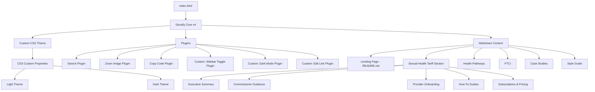

# Design Document: Documentation Site Redesign

## Overview

This design covers the complete redesign of the Pathway Analytics documentation and marketing site at docs.pathwayanalytics.com. The site is built on Docsify 4, a zero-build static site generator that renders Markdown files in the browser. The redesign introduces a modern design system, audience-segmented documentation for the Sexual Health Tariff Grouper, conditional sidebar navigation (active only within the Tariff Grouper section), dark mode with persistence, responsive layouts, accessibility compliance, and comprehensive SEO/branding.

The architecture remains a single-page application (SPA) served via GitHub Pages with hash-based routing. All content is authored in Markdown. The design system is implemented entirely in CSS custom properties, enabling dark mode toggling and consistent spacing/typography throughout. A small set of custom Docsify plugins handle the conditional sidebar visibility, per-page edit links, and dark mode toggling.

### Key Design Decisions

1. **Conditional sidebar via custom plugin** — Rather than fighting Docsify's default sidebar behaviour, a lightweight plugin monitors the current route and toggles a CSS class on `<body>` to show/hide the sidebar. This keeps configuration simple and avoids modifying Docsify internals.

2. **CSS custom properties for theming** — All colours, spacing, and typography are defined as CSS custom properties on `:root` (light) and `[data-theme="dark"]` (dark). This enables instant theme switching without class-based overrides scattered through the stylesheet.

3. **No build step** — Consistent with Docsify's philosophy, the site remains build-free. All assets are CDN-hosted, CSS is authored directly, and content is plain Markdown.

4. **Audience segmentation via directory structure** — The Tariff Grouper documentation is organised into subdirectories by audience (executive, commissioner, provider) allowing the sidebar `_sidebar.md` to reflect this structure naturally.

## Architecture



### Rendering Flow

1. Browser loads `index.html` with inline critical CSS and CDN references
2. Docsify initialises, reads `window.$docsify` configuration
3. Navbar loads from `_navbar.md` (displayed on all pages)
4. Route determines content: Docsify fetches the corresponding `.md` file
5. **Sidebar Toggle Plugin** checks if the route starts with `#/sexual-health-tariff/` — if yes, shows sidebar; otherwise hides it and applies full-width layout
6. Docsify renders Markdown to HTML in the content area
7. **Edit Link Plugin** appends a "Suggest an edit" link to the rendered content
8. Search plugin indexes all content on first load

### Routing Strategy

| Route | Content | Layout | Access |
|-------|---------|--------|--------|
| `#/` | Landing page (README.md) | Full-width, no sidebar | Navbar |
| `#/sexual-health-tariff/...` | Tariff Grouper docs | Sidebar + content | Navbar |
| `#/health-pathways` | Health Pathways landing | Full-width, no sidebar | Navbar |
| `#/ftci` | FTCi landing | Full-width, no sidebar | Navbar |
| `#/case-studies` | Case Studies index | Full-width, no sidebar | Navbar |
| `#/style-guide` | Style Guide | Full-width, no sidebar | Footer link |

## Components and Interfaces

### 1. index.html — Application Shell

The single HTML file that bootstraps everything:

- **Head**: Meta tags (SEO, Open Graph, robots, canonical), favicon references, critical inline CSS for above-the-fold rendering, Google Fonts preconnect + stylesheet link, custom CSS link
- **Body**: Skip navigation link, header with navbar placeholder, `<div id="app">` for Docsify, script tags (Docsify core, plugins, custom plugins)
- **Docsify Config** (`window.$docsify`):
  - `name`: 'Pathway Analytics'
  - `loadSidebar`: true
  - `loadNavbar`: '_navbar.md'
  - `routerMode`: 'hash'
  - `subMaxLevel`: 3
  - `search`: { placeholder, noData, depth: 4 }
  - `auto2top`: true
  - `repo`: false (replaced by custom corner widget)

### 2. Custom CSS Theme (`assets/css/custom.css`)

Structured in sections:
1. **CSS Custom Properties** — Colour palette, spacing scale, typography
2. **Base / Reset** — Font stack, line-height, body styles
3. **Layout** — Navbar, sidebar, content area, full-width mode
4. **Typography** — Headings (h1–h6), body text, code blocks, blockquotes
5. **Components** — Navigation cards, buttons/CTAs, image captions, edit links
6. **Dark Mode** — `[data-theme="dark"]` overrides
7. **Responsive** — Breakpoints at 768px and 1024px
8. **Accessibility** — Focus indicators, skip link, reduced motion

### 3. Custom Sidebar Toggle Plugin

```javascript
// Monitors route changes and toggles sidebar visibility
function sidebarTogglePlugin(hook, vm) {
  hook.doneEach(function () {
    const path = vm.route.path;
    const isTariffSection = path.startsWith('/sexual-health-tariff');
    document.body.classList.toggle('has-sidebar', isTariffSection);
    document.body.classList.toggle('full-width', !isTariffSection);
  });
}
```

**Interface**: Adds/removes CSS classes on `<body>`:
- `.has-sidebar` — Shows sidebar, content has left margin
- `.full-width` — Hides sidebar, content stretches to max-width

### 4. Custom Dark Mode Plugin

```javascript
// Manages dark mode toggle, localStorage persistence, OS preference
function darkModePlugin(hook, vm) {
  hook.mounted(function () {
    // Create toggle button in navbar
    // Read preference: localStorage > OS prefers-color-scheme > light
    // Apply data-theme attribute to <html>
    // Swap logo src for white variant when dark
  });
}
```

**Interface**:
- Sets `data-theme="dark"` or `data-theme="light"` on `<html>`
- Persists preference in `localStorage` under key `pa-theme-preference`
- Toggles logo `src` between standard and white variants

### 5. Custom Edit Link Plugin

```javascript
// Appends "Suggest an edit" link to each rendered page
function editLinkPlugin(hook, vm) {
  hook.afterEach(function (html) {
    const filepath = vm.route.file;
    const editUrl = `https://github.com/Pathway-Analytics/docs/edit/main/${filepath}`;
    const editHtml = `<div class="edit-link">
      <a href="${editUrl}" target="_blank" rel="noopener">
        <svg>...</svg> Suggest an edit
      </a>
    </div>`;
    return html + editHtml;
  });
}
```

**Interface**: Appends HTML after each page render. URL derived from `vm.route.file`.

### 6. Navbar (`_navbar.md`)

```markdown
- [Home](/)
- [Sexual Health Tariff](/sexual-health-tariff/)
- [Health Pathways](/health-pathways)
- [FTCi](/ftci)
- [Case Studies](/case-studies)
```

Rendered by Docsify into the navbar area. Fixed-position, always visible. The Style Guide is intentionally omitted from the navbar — it is linked from the footer for lower prominence.

### 7. Tariff Grouper Sidebar (`sexual-health-tariff/_sidebar.md`)

```markdown
- [Overview](/sexual-health-tariff/)
- **Executive**
  - [Executive Summary](/sexual-health-tariff/executive-summary)
- **Commissioner**
  - [Commissioner Guidance](/sexual-health-tariff/commissioner-guidance)
  - [Tariff Configurations](/sexual-health-tariff/configurations)
  - [Live Configurations](/sexual-health-tariff/live-configurations)
  - [Pathways](/sexual-health-tariff/pathways)
  - [Grouper Process](/sexual-health-tariff/grouper-process)
  - [Governance](/sexual-health-tariff/governance)
  - [Review Process](/sexual-health-tariff/review-process)
- **Provider**
  - [Provider Onboarding](/sexual-health-tariff/provider-onboarding)
  - [How-To Guides](/sexual-health-tariff/how-to-guides)
  - [Technical Guidance](/sexual-health-tariff/technical-guidance)
- [Subscriptions & Pricing](/sexual-health-tariff/subscriptions)
```

### 8. Landing Page (README.md)

Structured as a marketing/docs entry point:
1. Hero section with value proposition (≤30 words)
2. Navigation cards grid (4 cards: Tariff Grouper, Health Pathways, FTCi, Case Studies)
3. G-Cloud 14 accreditation badge (linked image, opens new tab)
4. External links: Tariff Grouper login, Configuration Portal
5. Contact section with mailto link

## Data Models

This is a static site — there are no runtime data models or databases. The "data" consists of:

### Content Structure (File System)

```
/
├── index.html                          # Application shell
├── README.md                           # Landing page content
├── _navbar.md                          # Top navigation
├── assets/
│   ├── css/
│   │   └── custom.css                  # Complete theme stylesheet
│   └── images/
│       ├── logo.png                    # Standard logo (local cache)
│       ├── logo-white.png              # White logo for dark mode
│       ├── g-cloud-badge.png           # G-Cloud 14 badge
│       ├── github/                     # GitHub icons
│       └── how-to/                     # How-to guide screenshots
│           ├── data-upload/
│           │   ├── step-1-navigate.png
│           │   └── step-2-upload.png
│           ├── tariff-calculation/
│           └── report-generation/
├── sexual-health-tariff/
│   ├── _sidebar.md                     # Section sidebar
│   ├── README.md                       # Section landing page
│   ├── executive-summary.md
│   ├── commissioner-guidance.md
│   ├── configurations.md              # Existing (reorganised)
│   ├── grouper-process.md             # Existing (reorganised)
│   ├── governance.md                   # Governance framework
│   ├── review-process.md              # Review cycle documentation
│   ├── technical-guidance.md          # Technical data submission guidance
│   ├── live-configurations.md         # Embedded iframe from production app
│   ├── pathways.md                    # Embedded pathway costing reference
│   ├── provider-onboarding.md
│   ├── how-to-guides.md
│   ├── subscriptions.md
│   └── grouper.md                     # Existing (reorganised)
├── health-pathways/
│   ├── _sidebar.md                     # For future sub-pages
│   └── README.md                       # Placeholder landing
├── ftci/
│   ├── _sidebar.md                     # For future sub-pages
│   └── README.md                       # Placeholder landing
├── case-studies/
│   ├── _sidebar.md                     # For future sub-pages
│   └── README.md                       # Case studies index
├── style-guide/
│   └── README.md                       # Design system documentation
├── .nojekyll
└── CNAME
```

### CSS Custom Properties Schema

```css
:root {
  /* Colours */
  --pa-primary: #1f4788;
  --pa-primary-hover: #0056b3;
  --pa-accent-1: #2e86de;       /* Complementary blue */
  --pa-accent-2: #27ae60;       /* Complementary green */
  --pa-text: #333333;
  --pa-text-muted: #6c757d;
  --pa-background: #ffffff;
  --pa-surface: #f8f9fa;
  --pa-border: #e9ecef;

  /* Spacing (8px base) */
  --space-xs: 8px;
  --space-sm: 16px;
  --space-md: 24px;
  --space-lg: 32px;
  --space-xl: 48px;

  /* Typography */
  --font-family: 'Roboto', -apple-system, BlinkMacSystemFont, sans-serif;
  --font-size-base: 16px;
  --line-height: 1.7;
  --heading-h1: 2.25em;
  --heading-h2: 1.625em;
  --heading-h3: 1.3em;
  --font-weight-normal: 400;
  --font-weight-medium: 500;
  --font-weight-bold: 700;

  /* Layout */
  --content-max-width: 80ch;
  --sidebar-width: 280px;
  --navbar-height: 60px;
}

[data-theme="dark"] {
  --pa-primary: #1a73e8;
  --pa-primary-hover: #4a9eff;
  --pa-accent-1: #64b5f6;
  --pa-accent-2: #81c784;
  --pa-text: #f1f1f1;
  --pa-text-muted: #adb5bd;
  --pa-background: #121212;
  --pa-surface: #1e1e1e;
  --pa-border: #444444;
}
```

### Docsify Configuration Object

```javascript
window.$docsify = {
  name: 'Pathway Analytics',
  loadSidebar: true,
  loadNavbar: '_navbar.md',
  mergeNavbar: true,
  routerMode: 'hash',
  subMaxLevel: 3,
  auto2top: true,
  maxLevel: 4,
  search: {
    placeholder: 'Type to search',
    noData: 'No matches found.',
    depth: 4,
    pathNamespaces: ['/sexual-health-tariff', '/case-studies', '/health-pathways', '/ftci', '/style-guide']
  },
  formatUpdated: '{DD}/{MM}/{YYYY}',
  notFoundPage: true
};
```

## Correctness Properties

*A property is a characteristic or behavior that should hold true across all valid executions of a system — essentially, a formal statement about what the system should do. Properties serve as the bridge between human-readable specifications and machine-verifiable correctness guarantees.*

### Why Property-Based Testing Does Not Apply

This feature is a static documentation site built with HTML, CSS, Markdown, and small inline Docsify plugins. It falls into several categories where PBT is not appropriate:

- **UI rendering and layout** — The design system, responsive behaviour, dark mode toggling, and accessibility are visual/layout concerns without pure-function input/output behaviour suitable for universal property assertions.
- **Configuration validation** — The Docsify configuration is declarative with no meaningful input variation.
- **Side-effect-only operations** — DOM class toggling, localStorage writes, and route monitoring are side effects with no return values to assert universal properties on.
- **Static content** — Markdown files and HTML templates have no runtime logic that varies meaningfully with generated inputs.

There is no meaningful "for all inputs X, property P(X) holds" statement that can be written for this feature. Property-based tests are therefore omitted entirely.

### Structural Correctness Checks (Automated Tooling)

Although PBT does not apply, the following structural correctness properties can be verified automatically via CI tooling:

### Property 1: Link integrity

*For any* internal or external link in the rendered site, following that link SHALL resolve to an HTTP 200 status code rather than a 404, timeout, or error.

**Validates: Requirements 14.1, 14.2, 6.3, 6.4** — Verified via `broken-link-checker` or `htmltest` in CI.

### Property 2: Valid JSON-LD structure

*For any* JSON-LD script element in `index.html`, parsing the content SHALL produce valid JSON that conforms to the schema.org Organization type with required properties (name, url, logo, contactPoint).

**Validates: Requirements 12.4** — Verified via Google Rich Results Test or a JSON schema validator.

### Property 3: Heading hierarchy

*For any* Markdown content page, the heading structure SHALL begin with a single h1 and progress sequentially (h2, h3, h4) without skipping levels.

**Validates: Requirements 5.7** — Verified via `markdownlint` rule MD001.

### Property 4: Colour contrast compliance

*For any* text/background colour combination in the rendered site (both light and dark mode), the contrast ratio SHALL meet WCAG 2.1 AA: ≥4.5:1 for normal text, ≥3:1 for large text.

**Validates: Requirements 5.1, 4.5** — Verified via Pa11y or axe-core in CI.

### Property 5: Image alt text presence

*For any* `` element in the rendered site, the element SHALL have an `alt` attribute (descriptive for content images, empty for decorative images).

**Validates: Requirements 5.4** — Verified via an accessibility linter or HTMLHint rule.

### Property 6: Meta tag completeness

*For any* deployment of the site, the `index.html` SHALL contain required SEO meta tags: title, description, canonical, robots, og:title, og:description, og:image, og:url.

**Validates: Requirements 12.1, 12.2, 12.3, 12.5** — Verified via a custom CI script or HTMLHint.

## Error Handling

| Scenario | Handling Strategy |
|----------|-------------------|
| **CDN script fails to load** | Docsify core is the only critical script. Plugins are loaded with `async` attribute so failures don't block rendering. Custom plugins are inline in `index.html` as a fallback. |
| **Markdown page 404** | Docsify's `notFoundPage` option enabled — displays a "Page not found" message rather than blank screen. Custom `_404.md` file with helpful navigation links. |
| **External font unavailable** | Font stack includes system fallbacks (`-apple-system, BlinkMacSystemFont, sans-serif`). `font-display: swap` ensures text renders immediately with fallback, swapping when font loads. No layout shift due to similar metrics. |
| **Image fails to load** | All images have descriptive `alt` text. CSS ensures broken images don't overflow containers (`max-width: 100%`, `height: auto`). |
| **localStorage unavailable** | Dark mode plugin wraps localStorage calls in try/catch. Falls back to OS preference (`prefers-color-scheme`), then defaults to light mode. |
| **Network timeout on page load** | Custom plugin monitors fetch duration. If content doesn't load within 10 seconds, injects a visible error message: "This page could not be loaded. Please check your connection and try again." |
| **JavaScript disabled** | The `<noscript>` tag in `index.html` displays a message explaining the site requires JavaScript (inherent Docsify limitation). |

## Testing Strategy

### Why Property-Based Testing Does Not Apply

This feature is a static documentation site built with:
- HTML configuration (a single `index.html`)
- CSS styling (custom properties, responsive breakpoints)
- Markdown content files
- Small inline JavaScript plugins (DOM manipulation, class toggling)

This falls squarely into the categories where PBT is not appropriate:
- **UI rendering and layout** — The design system, responsive behaviour, dark mode, and accessibility are visual/layout concerns best validated through visual regression testing and manual inspection
- **Configuration validation** — Docsify configuration is declarative with no meaningful input variation
- **Side-effect-only operations** — DOM class toggling, localStorage writes, and route monitoring don't have return values suitable for universal property assertions

### Recommended Testing Approach

#### 1. Manual Visual QA (Primary)
- Cross-browser testing (Chrome, Firefox, Safari, Edge)
- Responsive testing at breakpoints: 320px, 768px, 1024px, 1440px, 2560px
- Dark mode visual inspection in both themes
- Verify sidebar shows only on Tariff Grouper pages
- Verify full-width layout on all other sections

#### 2. Accessibility Audit
- Lighthouse accessibility score ≥ 90
- axe-core browser extension for WCAG 2.1 AA validation
- Manual keyboard navigation testing (tab order, focus indicators, skip link)
- Screen reader testing (VoiceOver on macOS, NVDA on Windows)
- Colour contrast validation using browser DevTools or WebAIM contrast checker

#### 3. Performance Validation
- Lighthouse Performance score targeting ≥ 90
- First Contentful Paint < 3s on simulated 4G
- CLS < 0.1 verified via Lighthouse or Web Vitals extension
- Verify `loading="lazy"` on below-fold images
- Verify `async`/`defer` on plugin scripts

#### 4. Functional Smoke Tests (Manual Checklist)
- [ ] Landing page loads with hero, navigation cards, G-Cloud badge
- [ ] Dark mode toggle persists across page reloads
- [ ] Dark mode respects OS preference on first visit
- [ ] Sidebar appears on all `/sexual-health-tariff/` routes
- [ ] Sidebar hidden on landing, case studies, health pathways, FTCi, style guide
- [ ] Search returns results with highlighted snippets
- [ ] "Suggest an edit" links point to correct GitHub file paths
- [ ] External links (login, config portal) open in same tab
- [ ] All images zoom on click
- [ ] Copy code button works on code blocks
- [ ] Mobile hamburger menu toggles navigation
- [ ] Mobile off-canvas sidebar slides in/out on Tariff pages
- [ ] Touch targets ≥ 44x44px on mobile
- [ ] Skip navigation link visible on keyboard focus

#### 5. Link Validation
- Use a link checker tool (e.g., `broken-link-checker` or htmltest) to validate all internal and external links resolve correctly
- Verify all Brand_Assets URLs (logo, favicon, icons) return 200

#### 6. SEO Validation
- Validate JSON-LD structured data with Google's Rich Results Test
- Verify Open Graph tags render correctly (use Facebook Sharing Debugger or opengraph.xyz)
- Verify robots meta tag, canonical URL, and meta description

### Test Execution

Since this is a static site with no build step or test runner, testing is primarily manual with tooling support:
- **Lighthouse CI** can be run via GitHub Actions on each push to validate performance, accessibility, and SEO scores
- **htmltest** or similar can validate links in CI
- **Pa11y** can run automated accessibility checks against the deployed site
